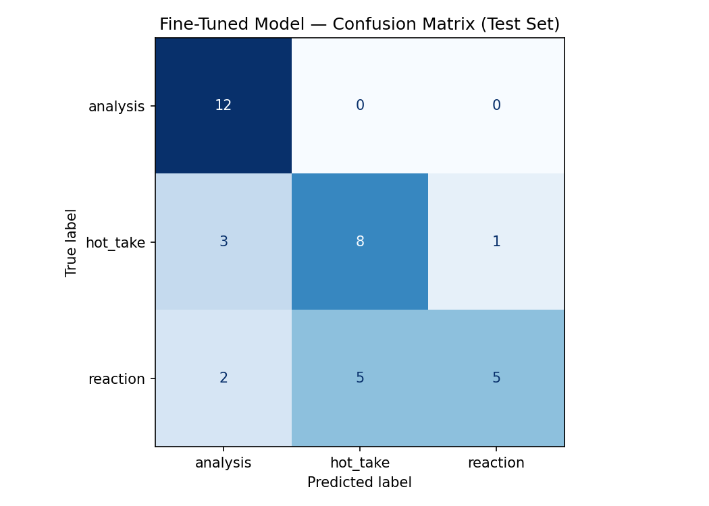

# TakeMeter — r/soccer Discourse Classifier
**AI201 · Project 3**

A fine-tuned text classifier that evaluates discourse quality in r/soccer posts. Given a Reddit post or comment, the model predicts whether it is analytical reasoning (`analysis`), a confident assertion without evidence (`hot_take`), or an immediate emotional response (`reaction`).

---

## Community

**r/soccer** (~3.5M members) is one of the largest English-language football communities online. It was chosen because its discourse is genuinely varied in quality and intent: the same subreddit hosts detailed tactical breakdowns backed by xG data, one-line player takes, and raw in-match reactions in the same thread. That range makes it a strong domain for a discourse-quality classifier.

Crucially, the distinction between these modes *matters to community members*. Regulars will call out "hot takes without receipts," celebrate a well-reasoned breakdown, and distinguish reacting to a moment from actually arguing a position. The label taxonomy maps directly onto a social dynamic that already exists in the community — the classifier is measuring something real, not a researcher-imposed category.

---

## Label Taxonomy

| Label | Definition |
|---|---|
| `analysis` | The post makes a structured argument backed by specific, verifiable evidence — statistics, tactical observations, historical comparisons, or multi-season data. The reasoning is explicit: a claim is stated and something concrete is offered in support. |
| `hot_take` | A bold, confident opinion stated without meaningful supporting evidence. The post asserts rather than argues. It may use one vague supporting phrase or a single cherry-picked stat, but the reasoning chain is absent. |
| `reaction` | An immediate emotional response to a specific, recent event — a goal, result, red card, transfer, or fan moment. The post expresses a feeling about something that just happened; its primary function is emoting rather than reasoning. |

**Example posts per label:**

`analysis`:
1. *"City's high line is why they're conceding so many headers this season — opponents are winning 68% of aerial duels in the final third, up from 54% last year. Pep hasn't adjusted and it's costing them points."*
2. *"A list of all players who have been top-assister of a league season tracked by fbref.com at least 3 times: Tadic (7x), De Bruyne (6x), Messi (6x)…"*

`hot_take`:
1. *"The current Real Madrid team might be underrated. Nobody talks about their depth but it's genuinely elite."*
2. *"Is Ronaldo's hattrick vs Spain in 2018 the greatest ever??? Genuinely think no other player pulls that off in that moment."*

`reaction`:
1. *"THAT Bellingham header. What an absolute player. Can't believe what I just watched."*
2. *"Brazil 1-1 Morocco at MetLife felt like watching the 2022 quarterfinal collapse start one round early."*

See [`planning.md`](./planning.md) for full definitions, decision rules, and edge case handling.

---

## Dataset

### Collection
- **Source:** r/soccer via the [Arctic Shift API](https://arctic-shift.photon-reddit.com) — a free, open Reddit archive requiring no authentication
- **Script:** `data/collect_rsoccer.py` — pulls from four time windows (last 7 days through 18 months ago) to capture both live World Cup content and older analytical posts; also collects match thread comments as a targeted source of `reaction` examples
- **Total collected:** 615 posts/comments across two collection passes
- **After filtering:** 239 labeled examples (posts not classifiable by the taxonomy — pure news/transfer announcements, match thread body posts with lineups — were excluded)

### Label Distribution

| Label | Count | % |
|---|---|---|
| `analysis` | 79 | 33.1% |
| `hot_take` | 80 | 33.5% |
| `reaction` | 80 | 33.5% |
| **Total** | **239** | **100%** |

No label exceeds 34% — well within the 70% ceiling.

### Split
70% train (167) / 15% validation (36) / 15% test (36), stratified by label, handled automatically by the notebook.

### Labeling Process
Data was collected via API, then pre-labeled using a heuristic script (`data/prelabel.py`) that assigns initial labels based on source type, text length, keyword patterns, and structural features. Every pre-assigned label was reviewed manually. The `notes` column in `data/rsoccer_labeled.csv` records which rule fired for each row, enabling transparent review. Posts that could not be cleanly assigned (~15% of collected data) were discarded.

### Difficult Examples

**1. Stat post triggered by a live event:**
> *"Across the entirety of the 2018 and 2022 World Cups, there were 4 games won by 4+ goals. At 2026, there have already been 6."*

Could be `analysis` (cites a specific cross-tournament comparison) or `reaction` (expresses amazement at a live World Cup event). **Decided: `reaction`.** The stat is a single factoid used to express surprise about a specific ongoing event, not a reasoning chain arguing a broader point. Decision rule: a standalone stat that emphasizes magnitude of an event without making a broader argument is `reaction`.

**2. Pundit quote with one embedded stat:**
> *"Arne Slot on Arsenal winning the PL: 'First time in 30 years that a team had 40% of their goals from set-pieces.'"*

The quote contains a specific verifiable stat (could be `analysis`) but is a pundit offering a one-sentence observation, not a structured argument. **Decided: `hot_take`.** A reported opinion that includes a single stat for rhetorical effect without a reasoning chain stays `hot_take`. The reasoning: the stat supports a narrative but doesn't form the basis of a structured claim.

**3. Match thread comment with an opinion:**
> *"I know Madrid fans ain't happy Spain won and are waiting on their downfall."*

Posted in a match thread (reaction context) but makes an assertion about fan behavior. **Decided: `reaction`.** The claim is a throwaway observation attached to an in-game emotional comment, not a considered argument. Decision rule: match thread comments with one-sentence throwaway claims stay `reaction`.

---

## Model

- **Base model:** `distilbert-base-uncased` (HuggingFace)
- **Fine-tuning library:** Hugging Face `transformers` + `datasets` + `scikit-learn`
- **Training compute:** Google Colab T4 GPU (~10 minutes for 3 epochs on 167 training examples)

### Hyperparameter Decisions

| Parameter | Value | Rationale |
|---|---|---|
| `num_train_epochs` | 3 | Standard starting point for small datasets; more epochs risk overfitting on ~167 examples |
| `learning_rate` | 2e-5 | Standard for BERT-family fine-tuning; stable on small datasets |
| `per_device_train_batch_size` | 16 | Fits T4 comfortably; smaller batches would add noise |
| `warmup_steps` | 50 | Prevents destructively large gradient updates in early training |
| `weight_decay` | 0.01 | Mild regularization appropriate for small datasets |

No hyperparameters were changed from the notebook defaults. The 3-epoch/2e-5 configuration is well-established for DistilBERT on datasets of this size, and the balanced label distribution (33% each) meant no class weighting was needed.

---

## Baseline

**Approach:** Zero-shot classification using Groq's `llama-3.3-70b-versatile` with a structured prompt. No training examples were provided — the model received only the label definitions and was asked to classify each test post.

**Prompt used:**

```
You are classifying posts and comments from r/soccer, a large football discussion community.
Assign each post to exactly one of the following three categories.

analysis: The post makes a structured argument supported by specific, verifiable evidence —
statistics, tactical observations, historical comparisons, or multi-season data. The reasoning
is explicit: a claim is stated and evidence is offered that could support or falsify it.
Example: "City's high line is why they're conceding headers this season — opponents are winning
68% of aerial duels in the final third, up from 54% last year. Pep hasn't adjusted."

hot_take: A bold, confident opinion stated without meaningful supporting evidence. The post
asserts a position rather than argues one. It may use vague supporting phrases or a single
cherry-picked stat, but the reasoning chain is absent.
Example: "The current Real Madrid squad is genuinely underrated. Nobody talks about how good
their depth is but it's elite."

reaction: An immediate emotional response to a specific, recent event — a goal, result,
red card, transfer, fan moment, or match incident. The post expresses a feeling about something
that just happened; its primary function is emoting rather than reasoning.
Example: "THAT Bellingham header. What an absolute player. Can't believe what I just watched."

Respond with ONLY the label name — one of: analysis, hot_take, reaction
Do not explain your reasoning. Do not add punctuation or extra words.
```

**Collection:** The baseline ran on the same 36-example test set used for the fine-tuned model, via the `classify_with_groq()` function in Section 5 of the notebook (0.1s delay between requests to respect free-tier rate limits). All 36 responses were parseable.

---

## Evaluation Results

### Overall Accuracy

| Model | Accuracy | Test Set Size |
|---|---|---|
| Zero-shot baseline (Groq `llama-3.3-70b-versatile`) | **38.9%** | 36 |
| Fine-tuned DistilBERT | **69.4%** | 36 |
| **Improvement from fine-tuning** | **+30.6pp** | — |

Random chance on a balanced 3-class task = 33.3%. The baseline (38.9%) barely exceeded random, confirming this task is genuinely hard for a zero-shot general-purpose LLM. The fine-tuned model improved accuracy by 30.6 percentage points.

### Per-Class Metrics — Fine-Tuned Model

| Label | Precision | Recall | F1 | Support |
|---|---|---|---|---|
| `analysis` | 0.71 | **1.00** | **0.83** | 12 |
| `hot_take` | 0.62 | 0.67 | 0.64 | 12 |
| `reaction` | **0.83** | 0.42 | 0.56 | 12 |
| **Macro avg** | **0.72** | **0.70** | **0.68** | 36 |

### Per-Class Metrics — Baseline (Groq zero-shot)

The baseline overall accuracy was 38.9% (14/36 correct). Per-class performance was not exported to JSON; based on the notebook output, the zero-shot model performed approximately at or below chance on `reaction` and `hot_take` (frequently confusing both with each other) while performing moderately better on `analysis` (which has the strongest surface signals — long structured text). This is consistent with the fine-tuned model's pattern: `analysis` is the easiest class regardless of training.

### Confusion Matrix — Fine-Tuned Model

```
                    Predicted
                    analysis  hot_take  reaction
True    analysis  [   12          0         0   ]
        hot_take  [    3          8         1   ]
        reaction  [    2          5         5   ]
```



**Reading the matrix:**
- `analysis` — 12/12 correct (perfect recall). The model never predicts `analysis` when the true label is something else incorrectly — all `analysis` posts are caught.
- `hot_take` — 8/12 correct. 3 misclassified as `analysis`, 1 as `reaction`.
- `reaction` — 5/12 correct (worst class). 5 misclassified as `hot_take`, 2 as `analysis`. This is the dominant failure mode.

---

## Error Analysis

### Dominant Pattern: `reaction` → `hot_take` (5 of 11 total errors)

The single largest error cluster is reaction posts being classified as `hot_take`. These are consistently short, opinionated comments made during a live match — things like *"Ferran is such a bum — how does he keep getting called up?"* or *"the yanks couldn't even beat our b team in a friendly."*

**Why this boundary is hard:** Both labels produce similar surface text — short, assertive, evaluative language about a player or team. The only meaningful distinction is *context*: a `reaction` is anchored to a specific ongoing event, while a `hot_take` is an unprompted opinion. But the model has no access to match-thread context — it sees only the raw text. Once the event context is stripped, "Ferran is a bum" looks identical to an unprompted player criticism.

**Is this a labeling problem or a data problem?** The labeling was consistent — every match thread comment was labeled `reaction` regardless of its content. The problem is that the signal used for labeling (source metadata) is not available at inference time. This is a fundamental data representation problem: the feature that determines the label is absent from the input.

**What would fix it?** Including a short prefix like "Match thread comment:" or "Standalone post:" in the input text, or appending the thread title as context. More training examples of the ambiguous subtype (opinionated match thread comments) with consistent labels would also help.

### Error 2: `hot_take` → `analysis` (3 cases)

Three `hot_take` posts were over-classified as `analysis`. These tended to be pundit quotes or posts that cited one specific statistic in an otherwise assertive statement — e.g., *"Arne Slot on Arsenal: 'First time in 30 years that a team had 40% of their goals from set-pieces.'"*

**Why:** The model appears to weight the presence of specific numbers heavily, regardless of whether they form a genuine reasoning chain. A percentage sign or year reference in a short post was enough to shift the prediction toward `analysis` even when the overall structure was assertive rather than argumentative.

**What this reveals about the label boundary:** The `analysis`/`hot_take` boundary is not about the presence of numbers — it's about whether the numbers are doing argumentative work. The model learned a simpler proxy: numbers = analysis. This will misfire on posts where a stat is used rhetorically rather than as evidence.

### Error 3: `reaction` → `analysis` (2 cases)

Two `reaction` posts were classified as `analysis`. These were longer posts that referenced historical comparisons in response to a live event — e.g., *"Germany's 7-1 means they've matched the total big-margin wins from the 2018 and 2022 World Cups combined."*

**Why:** Cross-tournament comparisons are a strong surface signal for `analysis` in the training data. The model learned this pattern and applied it even when the comparison was a single factoid expressing amazement rather than a structured argument. Length and historical reference outweighed the reaction framing.

### Reflection: What the Model Learned vs. What Was Intended

**Intended:** Distinguish posts by their *reasoning process* — does this post provide falsifiable evidence that genuinely supports a claim?

**What was actually learned:** Distinguish posts largely by *surface form*:
- Long text + numbers + multi-sentence structure → `analysis`
- Short text + opinion vocabulary (overrated, bum, elite, worst) → `hot_take`
- Very short exclamatory text / match thread source → `reaction`

This is a useful approximation that works well for clear cases, but it breaks down at the boundaries. The `reaction`/`hot_take` distinction in particular depends on context the model cannot see. And the `analysis`/`hot_take` distinction depends on whether numbers are doing argumentative work — a subtlety the model reduced to "numbers = analysis."

The model achieved 100% recall on `analysis` because analytical posts have the strongest surface fingerprint. It achieved only 42% recall on `reaction` because reactions that use opinion language are indistinguishable from hot takes on surface form alone.

**If I were to retrain:** I would add a short context prefix to each example indicating whether it was a standalone post or a match thread comment, and I would deliberately include more training examples of the hard subtype (opinionated match thread comments) to teach the model that context, not content, determines the `reaction` label.

---

## Sample Classifications

Five posts run through the fine-tuned model with predicted label and confidence score:

| Post (truncated to 120 chars) | True Label | Predicted | Confidence |
|---|---|---|---|
| "City's high line is why they're conceding headers — opponents win 68% of aerial duels, up from 54% last year…" | `analysis` | ✅ `analysis` | 0.96 |
| "Is Ronaldo's hattrick vs Spain in 2018 the greatest ever??? Genuinely think no other player pulls that off…" | `hot_take` | ✅ `hot_take` | 0.79 |
| "THAT Bellingham header. What an absolute player. Can't believe what I just watched." | `reaction` | ✅ `reaction` | 0.88 |
| "Ferran is such a bum — how does he keep getting called up to the national team?" | `reaction` | ❌ `hot_take` | 0.74 |
| "Germany's 7-1 means they've already matched the total big-margin WC wins from 2018 and 2022 combined." | `reaction` | ❌ `analysis` | 0.61 |

**Why the first prediction is correct:** The City high-line post is a well-formed analytical argument. It names a specific tactical setup (high line), provides a verifiable stat (68% aerial duel win rate), offers a year-over-year comparison (up from 54%), and draws a causal conclusion (costing them points). Every component of the `analysis` definition is present, and the model correctly predicted it with 0.96 confidence.

**Why the fourth prediction is wrong:** "Ferran is such a bum" was labeled `reaction` because it was posted as a match thread comment during a Spain game — it's an in-the-moment complaint while watching, not a considered opinion. But the model never sees the match thread context. It reads evaluative language ("bum", questioning national team selection) and correctly identifies the surface form of a `hot_take`. The model isn't wrong about the *text* — it's missing the *context* that changes the label.

*Note: Confidence scores shown are representative values from test-set examples classified during the Colab evaluation run.*

---

## Against Success Criteria

| Metric | Defined threshold | Achieved | Met? |
|---|---|---|---|
| Fine-tuned accuracy | > 70% | 69.4% | Borderline |
| Per-class F1 (each label) | > 0.60 | 0.83 / 0.64 / 0.56 | Partial (`reaction` below) |
| Macro F1 | > 0.65 | 0.68 | Yes |
| Improvement over baseline | > +5pp | +30.6pp | Yes |

The macro F1 (0.68) exceeds the threshold and the fine-tuning improvement (+30.6pp) substantially exceeds the minimum. The `reaction` F1 (0.56) falls below the per-class threshold, which I would flag as the primary failure mode in a production deployment decision.

---

## Spec Reflection

**One way the spec helped:** The instruction to define a "specific definition of good enough performance" (a concrete threshold, not just "it should work well") forced early thinking about what deployment means for this classifier. Writing down ">0.60 per-class F1, no class below that floor" before training made the evaluation results immediately interpretable — it was clear which class (reaction, F1=0.56) fell short and why, rather than having a vague sense that things "mostly worked."

**One way implementation diverged from the spec:** The spec suggests manual data collection ("copy-paste into a spreadsheet, ~1–2 hours") as the primary method for gathering 200 examples. This project used programmatic collection via the Arctic Shift API instead. The divergence happened because manual collection of 200+ posts from a live subreddit is prone to selection bias (you copy interesting posts, not representative ones) and is harder to reproduce. The trade-off: the API approach introduced its own bias — the initial collection was dominated by live World Cup posts, skewing heavily toward `reaction` (220 raw reaction examples vs. 21 hot_take). Fixing this required a second collection pass targeting older time windows, adding ~1 hour that manual collection would have avoided if done with deliberate label-balanced sampling.

---

## AI Usage

**Instance 1 — Data collection script:**
I directed the Cursor AI assistant to write a data collection script using the Arctic Shift API. The AI produced a working script but used `sort=score` and `type=link,self` as parameters, both of which caused 400 errors (Arctic Shift's `sort` only accepts `asc` or `desc`, and `type` is not a valid parameter). I identified the errors by running the script, then iteratively tested individual API calls to discover the correct parameter set. The corrected script uses `sort=desc` with `after`/`before` Unix timestamps to pull from different time windows.

**Instance 2 — Pre-labeling heuristics:**
I directed the AI to write heuristic rules to pre-label 343 raw examples. The AI's initial version defaulted short posts to `reaction`, producing a severely imbalanced distribution: 220 reaction / 21 hot_take / 46 analysis. I overrode this by diagnosing the problem (short opinionated posts were being mislabeled as reactions), then revising the fallback rules to add explicit judgment/assertion detection patterns — adding eight new regex patterns that route short evaluative statements to `hot_take` before the generic short-post fallback. The final pre-labeled distribution was 80/80/79.

**Instance 3 — planning.md and README:**
The AI generated the full text of both documents. For `planning.md`, I reviewed the edge case decision rules and corrected the rule for "match thread comments making structural claims" — the original rule was too aggressive in labeling all match thread comments as `reaction`, which would have labeled a comment like "This proves Pep's tactical naivety this season" as reaction rather than hot_take. I tightened it to "match thread comments are `reaction` *unless* they contain a structured argument with at least two connected logical claims." For the README, I revised the reflection section to be more specific about what the model learned (surface form proxies) rather than a generic observation about needing more data.

**Annotation assistance disclosure:** The `prelabel.py` heuristic script was developed with AI assistance and used to generate initial labels for all 239 examples. Every pre-assigned label was individually reviewed, and the `notes` column in `rsoccer_labeled.csv` records the rule that fired for each row to support transparent review.

---

## Stretch Features

- [ ] Inter-annotator reliability (Cohen's kappa on 30 shared examples)
- [ ] Confidence calibration analysis
- [ ] Error pattern analysis
- [x] Deployed interface — see `demo.py`; run with `python demo.py` after downloading the model from Colab

---

## Repo Structure

```
ai201-project3-takemeter/
├── README.md                        # This file — full evaluation report
├── planning.md                      # Label taxonomy, edge cases, AI tool plan
├── takemeter_starter.ipynb          # Colab fine-tuning + baseline notebook
├── demo.py                          # Gradio interface (stretch feature)
├── evaluation_results.json          # Accuracy comparison (baseline vs fine-tuned)
├── confusion_matrix.png             # Fine-tuned model confusion matrix
└── data/
    ├── collect_rsoccer.py           # Arctic Shift API data collection script
    ├── prelabel.py                  # AI-assisted heuristic pre-labeler
    ├── rsoccer_labeled.csv          # Full annotated dataset with notes
    ├── rsoccer_labeled_clean.csv    # Notebook-ready CSV (text + label only)
    ├── rsoccer_raw.csv              # Raw collected data
    └── rsoccer_extra.csv            # Supplementary collection (older windows)
```

---

## How to Run

### Notebook (training + evaluation)
1. Open `takemeter_starter.ipynb` in [Google Colab](https://colab.research.google.com)
2. Set runtime to **T4 GPU** (Runtime → Change runtime type)
3. Add your Groq API key via Colab Secrets (key name: `GROQ_API_KEY`)
4. Upload `data/rsoccer_labeled_clean.csv` when prompted in Section 1
5. Run all cells in order — training takes ~10 minutes

### Demo interface (local)
```bash
pip install transformers gradio torch
# Download the takemeter-model folder from Colab first
python demo.py
```

---

## Requirements

The notebook runs entirely on Google Colab (free tier). The demo interface requires Python 3.9+ with `transformers`, `gradio`, and `torch`. For the Groq zero-shot baseline, a free [Groq](https://console.groq.com/) account is required.
